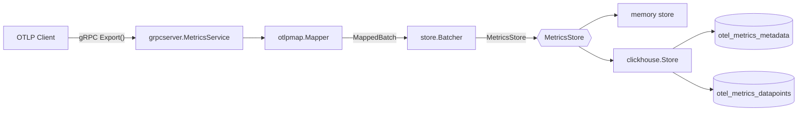

# OTLP Metric Storage (Go)

## Introduction

This repository implements a small backend that receives [OpenTelemetry metrics](https://opentelemetry.io/docs/concepts/signals/metrics/) over OTLP/gRPC, maps them to a normalized store model (metadata lookup + scalar datapoints), and persists them via a pluggable `store.MetricsStore` implementation (in-memory for fast tests, ClickHouse for production-shaped workloads).

## Architecture

Ingestion is interface-first: the gRPC service maps OTLP to `MetadataRow` / `DatapointRow`, enqueues through an async batcher with LRU metadata deduplication, and writes through `MetricsStore`. ClickHouse uses a two-table layout: `ReplacingMergeTree` metadata keyed by fingerprint and a unified `MergeTree` fact table for gauge and sum scalars, partitioned by day on event time.



## Design decisions

High-level trade-offs (see [`DECISIONS.md`](DECISIONS.md) for detail):

- **Fingerprinting:** Canonical `xxhash` over sorted maps and length-prefixed strings gives a deterministic 64-bit series id without JSON in the hot path.
- **Interface-first storage:** `MetricsStore` plus an in-memory implementation keep mapping, batching, and gRPC tests free of the ClickHouse driver until you opt in.
- **Two-table model:** Metadata (labels, scope, resource, sum temporality) lives in `otel_metrics_metadata`; datapoints store only time, value, flags, and `Fingerprint`, so fact rows stay narrow and gauges/sums share one scalar shape.
- **ClickHouse layout:** Metadata uses `ReplacingMergeTree(LastSeen)` for idempotent upserts; datapoints use `PARTITION BY toDate(TimeUnix)` and `ORDER BY (Fingerprint, TimeUnix)` so typical series+time-range queries prune partitions and use the primary key.
- **Batcher:** Bounded channels, periodic and size-triggered flush, LRU skip for metadata already written, retries with backoff, and `ErrBackpressure` when queues are full.
- **Shutdown:** `SIGINT`/`SIGTERM` → graceful gRPC stop → batcher flush → store close.
- **Observability:** OTel metrics and structured logs at the store abstraction (same instruments for memory and ClickHouse). See **Operational notes** below.

## Requirements

- Go **1.26+** (standard toolchain).

## Local dev with Docker Compose

A two-service stack (this server plus ClickHouse) uses the `clickhouse/clickhouse-server:26.2` image aligned with the integration tests. **Both** services use the same [Compose secret](https://docs.docker.com/compose/how-tos/use-secrets/) file (`./.secrets/ch_password`) mounted at `/run/secrets/ch_password`: the app passes it via `CLICKHOUSE_PASSWORD_FILE`, and the official ClickHouse image reads that path in its entrypoint (so the database user and the Go client always share one password).

1. Create a local secret file from the example (default content is `localdev`):

   ```shell
   cp .secrets/ch_password.example .secrets/ch_password
   ```

2. Build and start (the server waits until ClickHouse is healthy):

   ```shell
   docker compose up --build
   ```

3. Send test metrics, for example with the OpenTelemetry [`telemetrygen`](https://github.com/open-telemetry/opentelemetry-collector-contrib/tree/main/cmd/telemetrygen) tool:

   ```shell
   telemetrygen metrics --otlp-insecure --otlp-endpoint=localhost:4317
   ```

4. Optional: check that datapoints were stored:

   ```shell
   docker compose exec clickhouse clickhouse-client --password=localdev -q "SELECT count() FROM otel_metrics_datapoints"
   ```

   Use the same password string as in `.secrets/ch_password` (the example uses `localdev`).

## Run

**In-memory store** (no ClickHouse):

```shell
go run ./cmd/server --store=memory
```

**ClickHouse** (native interface) — the default in flags/env is `localhost:9000`. For a full local stack (server and ClickHouse) without installing ClickHouse on the host, use **Local dev with Docker Compose** above. For an external or host-installed instance, set `CLICKHOUSE_ADDR` and the other `CLICKHOUSE_*` values accordingly:

```shell
go run ./cmd/server --store=clickhouse
```

Plain `go run ./cmd/server` uses the **default** `--store` from flags (`memory` unless you pass `--store=clickhouse`).

Useful flags (see `cmd/server/main.go`); for each option the default comes from the **Env var** (if set) or the **Default** column, and an explicit flag still wins over the environment. A commented template for the same variables is in [`.env.sample`](.env.sample) — copy to `.env` and load into your environment (this repo does not auto-read `.env` in Go).

| Flag | Env var | Default | Purpose |
|------|---------|---------|---------|
| `--listenAddr` | `LISTEN_ADDR` | `localhost:4317` | gRPC listen address |
| `--maxReceiveMessageSize` | `MAX_RECV_MSG_SIZE` | `16777216` | Max gRPC receive message size in bytes |
| `--store` | `STORE` | `memory` | `memory` or `clickhouse` |
| `--clickhouse.addr` | `CLICKHOUSE_ADDR` | `localhost:9000` | Native protocol `host:port` |
| `--clickhouse.database` | `CLICKHOUSE_DATABASE` | `default` | Database name |
| `--clickhouse.username` | `CLICKHOUSE_USERNAME` | `default` | User |
| — | `CLICKHOUSE_PASSWORD` | *(empty)* | ClickHouse password (env only; no flag). Used when `CLICKHOUSE_PASSWORD_FILE` is unset. For production, prefer a file or secret mount over a literal in the environment. |
| `--clickhouse.password-file` | `CLICKHOUSE_PASSWORD_FILE` | *(empty)* | Path to a file whose contents (trimmed of trailing newlines) are used as the password. If set, it overrides `CLICKHOUSE_PASSWORD`. Omit both for an empty password. |

On startup the server calls `CreateTables` on the store (`IF NOT EXISTS` DDL for ClickHouse).

## Build and test

```shell
make build
# or
go build ./...

make test
# or
go test -count=1 ./...

make test-integration   # ClickHouse via testcontainers; build tag integration
```

## Query example (ClickHouse)

Join the fact table to metadata and filter by metric type and time (always bound `TimeUnix` so partitions prune):

```sql
SELECT
    m.MetricName,
    dp.TimeUnix,
    dp.Value
FROM otel_metrics_datapoints AS dp
INNER JOIN otel_metrics_metadata AS m USING (Fingerprint)
WHERE m.MetricType = 'gauge'
  AND dp.TimeUnix >= toDateTime64('2026-01-01 00:00:00', 9)
  AND dp.TimeUnix <  toDateTime64('2026-01-02 00:00:00', 9)
ORDER BY m.MetricName, dp.TimeUnix;
```

## Operational notes

- **Emitted metrics** (OTel; meter scope aligns with `store.OTelScopeName` in code): `otlp.export.received`, `otlp.datapoints.processed` (attribute `type`: `gauge` / `sum`), `metadata.cache.hit` / `metadata.cache.miss`, `store.batch.inserted` and `store.batch.failed` (attribute `kind`: `metadata` / `datapoints`), `store.batch.latency` (histogram), `queue.depth` (observable gauge per queue), `queue.dropped`.
- **Backpressure:** When metadata or datapoint queues are full, enqueue returns `ErrBackpressure`; the gRPC handler maps this to `ResourceExhausted`. Drops increment `queue.dropped`.
- **Datapoint “processed” counter:** Counts points accepted into the batcher after successful enqueue, not necessarily persisted yet; use batch/store metrics for write health.
- **Metadata dedup:** LRU reduces repeat `UpsertMetadata` calls; occasional duplicate upserts for the same new fingerprint are safe with `ReplacingMergeTree`.
- **Logs:** Structured `slog` on the export path includes `trace_id` / `span_id` when a span context is present; backpressure is logged at warn.
- **Retention:** Datapoints table DDL applies a TTL (see `internal/store/clickhouse/schema.go`); adjust for your environment.

## References

- [OpenTelemetry Metrics](https://opentelemetry.io/docs/concepts/signals/metrics/)
- [OpenTelemetry Protocol (OTLP)](https://github.com/open-telemetry/opentelemetry-proto)
